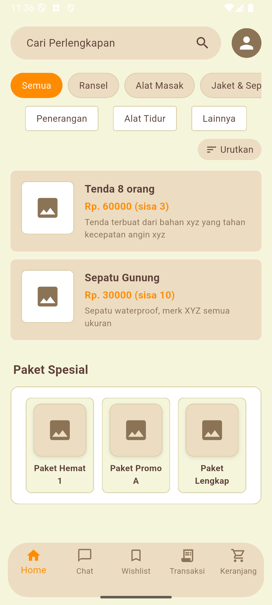
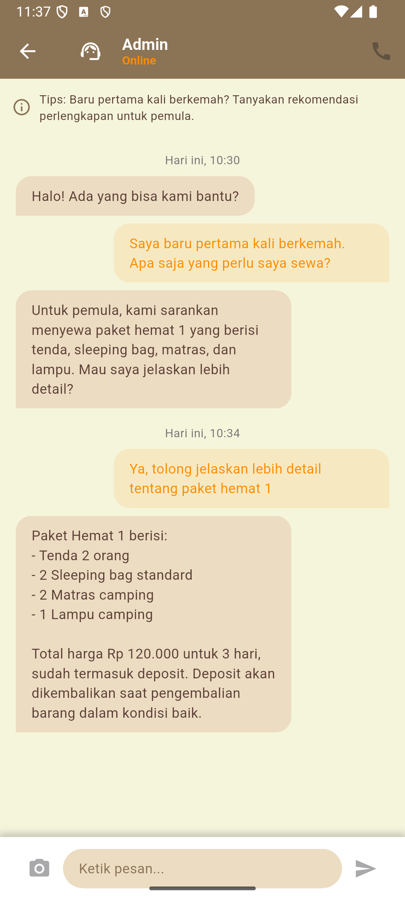
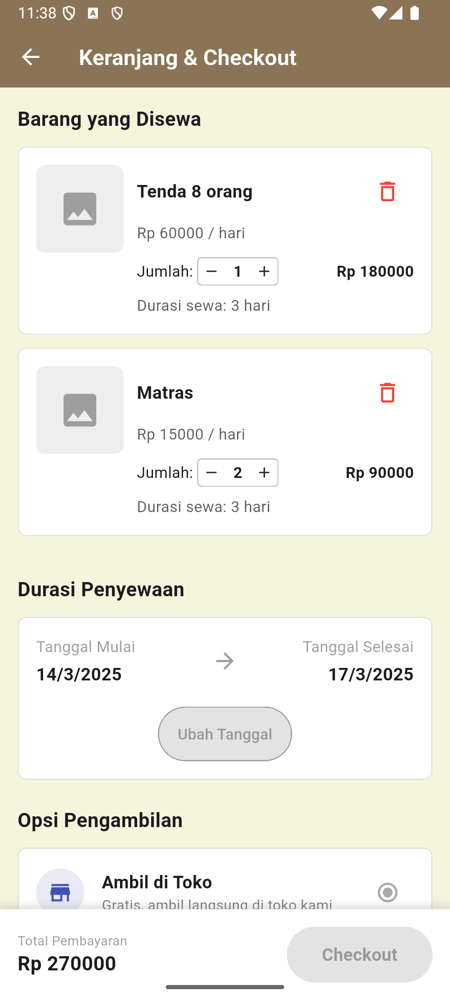

# Kuis 1 Mata Kuliah Pemrograman Visual

## Deskripsi Aplikasi
CampEase adalah aplikasi berbasis Flutter yang didesain untuk memudahkan pengguna dalam menyewa peralatan perkemahan. Kami membuat UI statis untuk menunjukkan seperti apa desain yang akan dibuat pada aplikasi dengan mempertimbangkan banyak hal termasuk pain points dari sudut pandang pengguna dengan beberapa persona.

## Halaman dan Fitur
Aplikasi terdiri dari beberapa halaman utama dengan navigasi utama dibagian bawah pada home page:

### 1. Halaman Utama (Home)
- Filter Kategori (Semua, Ransel, Alat Masak, Jaket & Sepatu, Tenda), ada juga filter Sub-kategori untuk filter lebih spesifik (Penerangan, Alat Tidur, Lainnya)
- Tampilan produk yang tersedia, **jika ditekan akan pindah ke page detail_item_page.dart** alias page detail produk yang ditekan
- Bagian informasi Paket Spesial yang menampilkan penawaran paket hemat, **jika ditekan akan pindah ke page packages_page.dart** yang berisi detail informasi dari paket tersebut
- Navigasi Utama Aplikasi dibagian bawah dengan BottomNavigationBarItem, yang mana ada pilihan ada beberapa pilihan yaitu:
  - `Home` akan mengarah ke page halaman utama.
  - `Chat` akan mengarah ke chat page alias fitur chat admin.
  - `Wishlist` akan mengarah ke wishlist page.
  - `Transaksi` akan mengarah ke transaction page.
  - `Keranjang` akan mengarah ke cart checkout page alias page keranjang dan checkout.

### 2. Detail Item
- **Dapat diakses dengan mengklik item produk di halaman utama**
- Ada bagian rating produk dengan bintang dan banyaknya ulasan, **jika ditekan akan mengarah ke review rating page**
- Menampilkan informasi lengkap dan lebih detail tentang produk
- Fitur untuk memilih jumlah barang yang akan disewa
- Tombol untuk menambahkan produk ke keranjang
- Tombol dengan icon love/hati yang akan menambahkan produk ke wishist
- Tombol kembali di pojok kiri atas untuk kembali ke halaman utama

### 3. Chat (Admin)
- **Dapat diakses melalui bottom navigation bar (navigasi utama)**
- Tampilan percakapan dengan admin
- Tips untuk pengguna pemula yang membutuhkan bantuan
- Ada fitur kirim foto dengan icon kamera
- Ada fitur telepon admin dengan icon telepon
- Tombol kembali di pojok kiri atas untuk kembali ke halaman utama

### 4. Wishlist
- **Dapat diakses melalui bottom navigation bar**
- Menampilkan daftar barang yang telah ditandai sebagai favorit
- Fitur untuk menambahkan langsung ke keranjang dari wishlist
- Tombol kembali di pojok kiri atas untuk kembali ke halaman utama

### 5. Transaksi
- **Dapat diakses melalui bottom navigation bar**
- Tab "Aktif" untuk pesanan yang sedang berlangsung
- Tab "Riwayat" untuk pesanan yang telah selesai
- Status pesanan yang ditampilkan dengan warna berbeda (Menunggu Pembayaran, Diproses, Siap Diambil, Sedang Digunakan, Selesai(Riwayat))
- Tombol kembali di pojok kiri atas untuk kembali ke halaman utama
- Setiap pesanan bisa di klik untuk menampilkan detail informasi dari pesanan tersebut
- Khusus untuk pesanan dengan status sedang digunakan akan muncul pilihan **ajukan pengembalian yang akan mengarah ke return page alias halaman pengembalian barang**

### 6. Keranjang & Checkout
- **Dapat diakses melalui bottom navigation bar atau setelah menambahkan barang ke keranjang**
- Daftar barang yang akan disewa
- Pengaturan tanggal dan durasi penyewaan
- Opsi pengambilan (di toko atau diantar)
- Pilihan metode pembayaran dan pilihan kode promo
- Ringkasan pesanan dan informasi ketentuan deposit
- Tombol kembali di pojok kiri atas untuk kembali ke halaman utama

### 7. Halaman Paket
- **Dapat diakses dengan mengklik item paket di bagian Paket Spesial pada halaman utama**
- Detail tentang isi paket, manfaat, dan syarat ketentuan
- Harga paket dan diskon yang didapat
- Tombol kembali di pojok kiri atas untuk kembali ke halaman utama

### 8. Halaman Status Pesanan
- **Dapat diakses dari halaman Transaksi dengan mengklik pesanan aktif**
- Menampilkan timeline status pesanan
- Instruksi pembayaran via transfer bank (asumsinya bisa berubah instruksi jika pada saat checkout juga berbeda cara pembayarannya (untuk pesanan yang belum dibayar)
- Informasi pengambilan berisi alamat dan jam kerja toko beserta kode pengambilan (untuk pesanan yang siap diambil)
- Tombol kembali di pojok kiri atas untuk kembali ke halaman transaksi

### 9. Halaman Pengembalian
- **Dapat diakses dari halaman Transaksi dengan mengklik pesanan yang sedang digunakan**
- Form untuk melaporkan kondisi barang
- Pemilihan metode pengembalian (kembali ke toko atau dijemput)
- Informasi terkait pengembalian deposit berdasarkan kondisi barang
- Tombol kembali di pojok kiri atas untuk kembali ke halaman transaksi

### 10. Halaman Ulasan dan Rating
- **Dapat diakses dari halaman Detail Item dengan mengklik bagian rating**
- Menampilkan ulasan dari pengguna lain
- Distribusi rating (1-5 bintang)
- Filter ulasan berdasarkan rating
- Tombol kembali di pojok kiri atas untuk kembali ke halaman detail produk terkait

## Palette Warna
Aplikasi menggunakan palette warna earthtone yang terdiri dari:
- Warna Utama: Orange (`#FF8C00`)
- Warna Sekunder: Hijau Sea Green (`#2E8B57`)
- Background: Beige Earth Tone (`#F5F5DC`)
- Elemen UI: Earth Brown (`#8B7355`) dan turunannya
- Text: Dark Brown (`#5D4037`)

Ada beberapa warna lain yang digunakan untuk beberapa hal khusus seperti warna status transaksi maupun beberapa icon atau elemen lainnya.

## Referensi Desain
Desain aplikasi ini terinspirasi dari beberapa sumber:
1. Material Design Guidelines - untuk layout dasar dan prinsip navigasi
2. Earthtone Color Palette - untuk skema warna yang menyatu dengan tema outdoor
3. E-commerce App UI Patterns - untuk alur checkout dan tampilan produk
4. Booking App Interfaces - untuk sistem tanggal dan durasi penyewaan

Aplikasi ini dikembangkan sebagai project pembelajaran untuk Flutter UI dan didesain dengan fokus pada desain interface pengguna saja untuk penyewaan alat perkemahan.

## Dokumentasi

